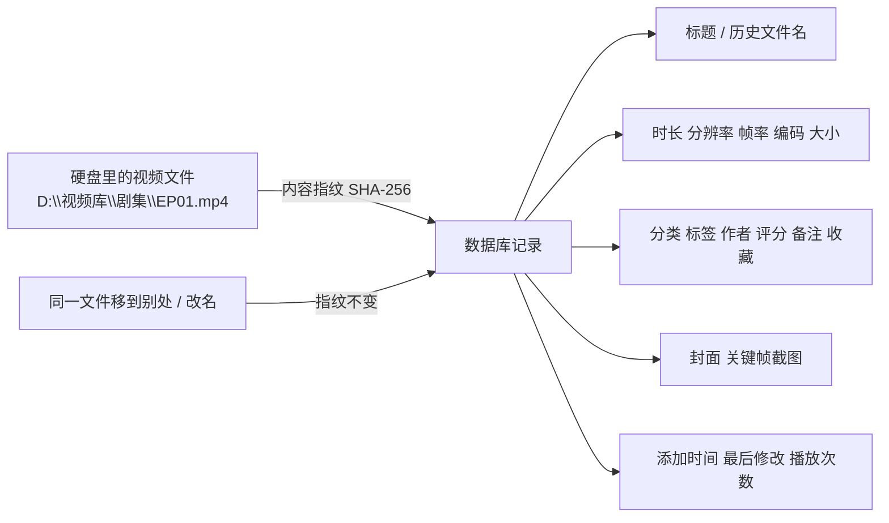
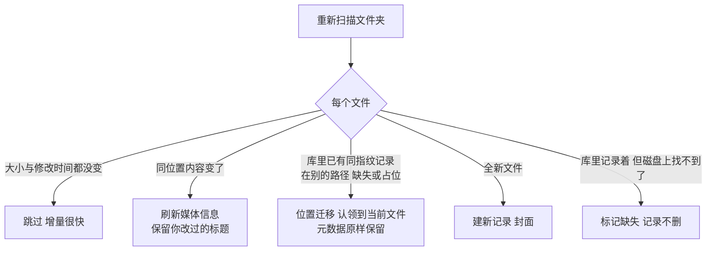

# VideoManager — 本地视频管理与元数据整理工具

VideoManager 是一款**本地优先**的视频管理软件：**Windows 端**扫描你硬盘上的视频、建立索引、整理元数据（分类/标签/作者/评分/备注/收藏）、生成封面与关键帧，并提供批量选择、重命名、格式转换、统计与局域网服务；**Android 端**通过局域网连接 Windows 端浏览视频库。**所有视频文件与元数据都保存在你自己的电脑上**，不依赖任何云服务。

> ### 本文主线（先读这一段）
>
> 视频文件是你的**资产**，元数据是这份资产的**档案**——档案跟人走、不跟文件夹走：
> 文件搬了家、改了名、甚至被删掉，档案都还在；只要文件还在磁盘上，**重扫一次就能重新对上号**。
> 理解这条关系，下面所有功能都是顺理成章。

---

## 目录

- [1. 两个世界](#1-两个世界)
- [2. 元数据生命周期](#2-元数据生命周期)
- [3. 数据放在哪里](#3-数据放在哪里)
- [4. 备份与恢复](#4-备份与恢复)
- [5. 显示范围](#5-显示范围)
- [6. 常见问题](#6-常见问题)
- [7. 功能特性](#7-功能特性)
- [8. 技术栈与目录结构](#8-技术栈与目录结构)
- [9. 快速开始](#9-快速开始)
- [10. 安装包与文档](#10-安装包与文档)

> 📷 **关于本文插图**：全文已按章节预留插图位（形如 `<!-- 📷 插图位：… -->` 的注释）。
> 你需要配图时，把图片放入仓库根目录的 `images/` 文件夹（首次使用请先看 [images/README.md](images/README.md)），
> 然后将对应注释替换为 `` 即可。

---

## 1. 两个世界

VideoManager 里有两层完全不同的事物，请先分清：

| | **本地视频文件** | **元数据** |
|---|---|---|
| 是什么 | 你磁盘上真实的 `.mp4 / .mkv / .avi …` 文件 | 数据库里关于每个视频的**档案** |
| 谁拥有 | 你，用资源管理器就能看到、管理 | VideoManager 的本地数据库 |
| 存放在哪 | 你指定的任意文件夹 | 软件目录 `data/` 下（见第 3 章） |
| 会被程序搬动吗 | **永远不会** | —— |
| 被删除后 | 记录保留、标记「缺失」，仍可继续整理 | 删库不影响任何文件 |

**VideoManager 从不复制、移动、删除你的视频文件**，只有三种例外且都需要你显式操作：删除记录时勾选「移除并删除文件」、执行批量重命名、执行格式转换（含「删除源文件」选项）。

这使它区别于"把视频收进自己库里的播放器"：你可以随时用资源管理器随意整理文件，改完回到软件重新扫描即可。

<!-- 📷 插图位：建议放一张「文件层 vs 元数据层」双层对照示意（或软件主界面截图），例如 images/01-two-worlds.png -->

### 1.1 一条记录 = 一个视频身份

扫描/导入时，程序为每个视频文件流式计算 **SHA-256**（按内容得出的唯一指纹），元数据记录就与这个视频"绑定"：



- 记录里的 `file_path` 只是**「当时扫到它的位置」**，不是锁定的归属；
- 判断"是不是同一个视频"永远看 **SHA-256 指纹**，而不是路径或文件名——同一内容的文件无论叫什么、放在哪个盘，库里始终只有**一条**记录（自带重复检测与合并迁移）。

---

## 2. 元数据生命周期

这一章描述软件的日常行为，可在「导入页」与「视频库 / 元数据页」直接观察到。

### 2.1 首次导入：文件 → 记录

在导入页添加文件夹（可递归）并扫描，程序对每个视频文件依次：

1. 按扩展名过滤出视频文件；
2. 用 ffprobe 读取媒体信息（时长/分辨率/编码/格式/帧率等）；
3. 流式计算 SHA-256 指纹；
4. 截取一帧生成封面（`<sha256>.jpg`）；
5. 插入一条记录，标题默认取文件名。

<!-- 📷 插图位：建议放「导入页 + 扫描任务进度」截图，例如 images/02-import.png -->

### 2.2 再次扫描：每次只有五种结果



### 2.3 文件被移动 / 改名：重扫一次就回来

文件在软件外被移动或改名后，旧路径失效，但**指纹还在**。此时：

1. 到导入页**重新扫描**（文件在原文件夹内），或扫描它现在所在的文件夹；
2. 程序按 SHA-256 找到原记录 → **位置迁移**，记录回到「本地就绪」；
3. 你整理的标题、分类、标签、评分等**全部原样保留**；
4. 新文件名追加进**历史文件名**（只读），可追溯"它曾经叫什么"。

> 只有一种情况标题会跟随新文件名：标题从未被你改过（一直是旧文件的默认名）时，迁移后自动换成新文件名。

### 2.4 文件被删除：记录留着，标记「缺失」

删除文件、或把它移出所有已导入文件夹后再扫描，记录标记为 **缺失**：

- 元数据、封面、关键帧、播放统计**全部保留**，仍可浏览、编辑、整理；
- 详情/编辑页的「本地位置」显示为 **无本地文件**；
- 默认视图会把它藏起来，切到「全部」或元数据页的「隐藏本地」即可看到（见第 5 章）。

**程序绝不会因为文件不见了就悄悄删掉你的元数据**——几千条整理好的分类标签，不会因为一次误删文件就付诸东流。

### 2.5 换电脑 / 恢复备份：占位 → 认领

从备份恢复后，库里的记录**没有路径**（备份本身不存路径），以 `restored://` 占位形式存在：元数据、封面、关键帧都在，能正常浏览编辑，只是没有指向本地文件。

要把档案重新绑回真实文件，只需三步：

1. 确认视频文件在磁盘上（放哪个文件夹都行）；
2. 在**导入页扫描该文件夹**（就是普通扫描操作）；
3. 程序按 SHA-256 逐条匹配占位记录 → 自动迁移为真实路径，并补齐缺失的关键帧。

这就是"恢复备份后重扫一遍，原来整理的元数据全回来了"的完整逻辑。

<!-- 📷 插图位：建议放「恢复向导 → 重扫认领」的两张截图拼图，例如 images/03-restore-adopt.png -->

### 2.6 两个防误伤细节

- **标题保护**：重扫时，手动改过的标题绝不覆盖；只有默认标题（=文件名）才跟随文件变化。
- **指纹先于入库**：新文件先算完 SHA-256 再写入，避免把重复文件重复入库；扫描失败的文件会跳过并在结果中统计为「失败」。

---

## 3. 数据放在哪里

| 内容 | 位置 | 说明 |
|---|---|---|
| 视频文件本体 | **你指定的任意文件夹** | 程序只读，永不搬动 |
| 数据库 `videomanager.db` | 软件目录 `data/` | 全部元数据（WAL 模式） |
| 封面缩略图 | `data/thumbnails/`，文件名即 `<sha256>.jpg` | 可删除，重扫自动重建 |
| 关键帧截图 | `data/keyframe/` | 可删除，重扫文件夹后自动补齐 |
| 恢复快照 | `data/restore-snapshots/` | 恢复前自动备份数据库，保留最近 20 份 |
| 备份压缩包 | 你在设置里指定的备份目录 | 见第 4 章 |

> 打包版默认把数据放在**软件所在目录的 `data/` 子目录**（绿色版解压即用、安装版紧挨 exe）；安装到 Program Files 等不可写目录时自动回退到系统用户数据目录。绿色版整包拷贝即可连同数据一起迁移。

<!-- 📷 插图位：建议放一张软件目录结构截图（含 data/thumbnails/ 等），例如 images/04-data-dir.png -->

---

## 4. 备份与恢复

入口：「设置 → 备份与恢复」。

- **立即备份**：把全部视频元数据打包成一个 ZIP（文件名带时间到秒，自动保留最近 30 份）；
- **自动备份**：开启后每次保存元数据都自动执行一次备份；
- **恢复备份**：打开安全恢复向导（见下）。

### 4.1 安全恢复向导：可预览、可配置、可回滚

恢复不再是一次"清空重来"的冒险操作，而是分四步的受控流程：

1. **校验与差异分析（只读）**：先校验备份完整性（zip 可解压、data.json 合法、每条 SHA-256 为 64 位十六进制、备份内重复自动去重），再与本地库按指纹逐条比对，生成差异报告：**备份独有 / 本地独有 / 冲突（同指纹但元数据不一致）/ 完全一致**，均可查看明细。
2. **选择恢复模式**：
   - **仅补缺（最安全）**：只新增本地缺失的备份条目，已有记录一概不动；
   - **本地优先合并**：冲突时保留本地元数据，只新增备份独有条目；
   - **备份优先合并**：冲突时以备份覆盖本地，只新增备份独有条目；
   - **完全恢复（清空重建）**：清空当前全部记录后按备份整体重建。
   - 除完全恢复外，**本地独有记录默认保留**——恢复不会丢弃你的整理成果。
3. **执行前自动快照**：任何破坏性操作前，先把数据库完整副本存入 `data/restore-snapshots/`（保留最近 20 份）。恢复对数据库的全部改动在**单个事务**内完成，中途失败会整体回滚；封面/关键帧属可重建文件，个别写入失败仅警告。
4. **可回滚 + 全程留痕**：恢复完成后可一键回滚到恢复前快照；每次恢复/回滚的时间、模式、差异摘要、逐条变更明细都记入「恢复记录」，可在设置页随时查看。

<!-- 📷 插图位：建议放「恢复向导（差异预览 + 模式选择）」截图，例如 images/05-restore-wizard.png -->

### 4.2 备份 ZIP 里有什么（以及没有什么）

```
videomanager-backup-20260905-123456.zip
├── data.json          # 全部元数据：标题/指纹/媒体信息/分类标签作者(含颜色)/评分/备注/收藏/历史文件名/关键帧记录…
├── images/            # 每部视频的封面 <sha256>.jpg
└── keyframe/          # 关键帧截图
```

- ✅ 包含：指纹、标题、媒体信息、分类/标签/作者及颜色、评分、备注、收藏、历史文件名、封面、关键帧、播放统计、时间信息。
- ❌ **不包含视频文件本身**（备份很小、很快）；
- ❌ 不包含文件绝对路径——**备份因此可以在任意电脑、任意目录结构上恢复**，这正是「恢复后重扫认领」成立的前提。

### 4.3 引用计数与物理删除分离

删除记录或恢复完成时，程序不会立即删除封面/关键帧图片，而是以 SHA-256 引用计数为准执行**垃圾回收**：只清理库中已无任何记录引用的孤儿封面（`thumbnails/<sha256>.jpg`）与关键帧（`keyframe/Keyframe_<sha256>_NN.jpg`）。**你磁盘上的视频文件永远不会被自动删除**——即使清空全部记录也只影响程序生成的图片。

---

## 5. 显示范围

列表里出现谁，取决于**文件在不在**。两个列表页的范围选项不同：

**视频库页**（面向播放与浏览）：

| 范围 | 含义 |
|---|---|
| 全部 | 所有记录（含缺失） |
| 仅显示本地 | 只看磁盘上真实存在的文件 |
| 仅显示收藏 | 只看收藏过的记录 |

**元数据页**（面向整理与维护）：

| 范围 | 含义 |
|---|---|
| 显示全部 | 所有记录 |
| 仅显示本地 | 只看真实存在的文件 |
| 仅显示收藏 | 只看收藏过的记录 |
| 隐藏本地 | 只看没有本地文件的记录（缺失 + 恢复占位） |
| 未分类 | 只看分类或作者未填写的记录 |

> 缺失与占位记录仍有封面、关键帧和全部元数据，可正常编辑，只是「本地位置」显示为无本地文件。

---

## 6. 常见问题

**Q1：视频文件会被程序移动或删除吗？**
不会。程序只读取文件；唯一需要你主动确认的删除路径是「删除记录并删除文件」「重命名」「转换并删除源文件」。

**Q2：我把视频从 A 盘移到 B 盘或改了名，记录会丢吗？**
不会。重扫一次（第 2.3 节），按指纹自动迁移，标题/分类/标签原样保留。

**Q3：视频文件被删了，整理的元数据还有用吗？**
有用。记录标记「缺失」并完整保留；文件找回后重扫即可恢复就绪。

**Q4：换电脑后，分类标签还能找回吗？**
能。旧机「立即备份」→ 新机（或重装后）「恢复备份」→ 扫描视频文件夹自动认领（第 2.5 / 4 章）。备份不含路径，可跨任意目录结构恢复。

**Q5：恢复备份后视频库是空的 / 全是占位？**
正常现象。恢复出的记录没有路径，在导入页扫描视频所在文件夹即可逐条认领。

**Q6：封面和关键帧可以删吗？会不会影响视频？**
可以删，不影响视频。删除后重扫对应文件夹会自动重建；删除记录时程序按引用计数自动清理孤儿图（第 4.3 节）。

**Q7：同一个视频会不会在库里出现两条？**
不会。入库以 SHA-256 指纹为准（自带重复检测）；已存在的同指纹记录会走位置迁移合并，而不是新建。

**Q8：「隐藏本地」「缺失」这些词出现在哪里？**
元数据页的范围下拉里。它们用于管理"暂时没有文件"的档案（第 5 章）。

<!-- 📷 插图位：如需要，可在此放一张「元数据页范围下拉」特写，例如 images/06-scope.png -->

---

## 7. 功能特性

### Windows 端

- **导入与增量索引**：递归扫描文件夹、按扩展名过滤、ffprobe 提取媒体信息、SHA-256 唯一身份与重复检测；未变更文件秒级跳过，消失文件自动标记缺失。
- **元数据整理**：分类 / 标签 / 作者（各自可设名称与颜色、按名称或使用数量排序），评分、备注、收藏；编辑候选下拉按你的设置排序，范围切换见第 5 章。
- **封面与关键帧**：导入时生成封面与关键帧（≥300s→12 张 / ≥180s→9 张 / ≥60s→6 张 / ≥1s→3 张，960px JPEG）；视频库与元数据页**右键视频**打开关键帧抽屉，点小图放大。
- **封面显示模式**：视频库可切换「横屏比例」（16:9 黑底居中）与「正常比例」；元数据页封面固定为横屏黑底居中模式。
- **批量选择**：元数据页长按封面（约 0.55 秒）或点「多选」进入批量模式，支持批量收藏/取消收藏、设置分类/作者、追加标签、修改备注、删除记录（仅移除记录或连同本地文件）；选择跨分页保留，删除走引用计数 GC，绝不误删未选中的视频。
- **批量重命名**：前缀/后缀规则 + 实时预览与冲突检测 + 一键撤销；另支持批量修改扩展名。
- **格式转换**：FFmpeg 集成，可导入多个文件或整个文件夹；MP4 / MKV / WebM，三档画质（CRF 高 18 / 中 23 / 低 28）；输出目录可选"源文件目录"或指定目录；转换后可选删除源文件；队列实时进度。
- **任务控制**：任务页每条任务支持 暂停/继续/取消/重试/删除——扫描进行中可在文件边界暂停与取消，转换进行中可取消并自动清理半成品；失败/取消的任务可一键重试；「清空记录」只清历史，不影响排队与进行中任务。
- **统计与去重**：总数/总时长/总大小；分类/标签/作者/方向分布可点击跳转筛选；SHA-256 重复视频审查。
- **播放集成**：调用 PotPlayer，自动检测或手动选择播放器路径。
- **局域网服务**：内置 HTTP 服务（Bearer Token + 6 位配对码），为 Android 端提供列表/详情/缩略图/同步 API；**默认关闭**，开关状态自动记忆。
- **主题系统**：跟随系统 / 明亮 / 深色 + 11 种中国色配色；每页条数（2–525）与网格/列表视图自定义。
- **备份与恢复**：一键 ZIP 备份 + 可选自动备份；恢复为安全向导（校验 + 差异预览 + 四种模式 + 自动快照可回滚 + 全程操作日志），详见第 4 章。

<!-- 📷 插图位：建议放一组界面拼图（视频库 / 元数据批量 / 恢复向导），例如 images/07-windows-ui.png -->

### Android 端

- 局域网连接 Windows 端，浏览视频库（网格/列表）、搜索、按分类/标签/作者/方向筛选与排序。
- 同步 Windows 端元数据（含离线缓存），断网后可浏览最近同步的数据。
- 本地与网络缩略图、视频详情查看；跟随系统/明亮/深色主题，配色与 Windows 端一致。

---

## 8. 技术栈与目录结构

| 端 | 框架 | 数据库 | 说明 |
|---|---|---|---|
| Windows | Electron + Vue 3 + TypeScript（electron-vite） | SQLite（`node:sqlite`，WAL） | Naive UI、Pinia、Vue Router；内嵌 ffprobe/FFmpeg、PotPlayer 调用、局域网 HTTP API |
| Android | Flutter 3（Material 3） | SQLite（索引缓存） | Dio、cached_network_image |

```
VideoManager/
├── desktop/            # Windows 端 (Electron + Vue3 + TS)
│   └── src/
│       ├── main/       # 主进程：窗口、SQLite、IPC、局域网服务
│       │   ├── db/     # 数据库层 (schema.sql + 迁移)
│       │   └── services/  # 扫描/关键帧/元数据/转换/重命名/备份恢复/任务队列等服务
│       ├── preload/    # contextBridge 安全桥
│       └── renderer/   # Vue3 UI：视频库/元数据/标签管理/导入/转换/重命名/任务/设置/关于
├── android/            # Android 端 (Flutter)
├── shared/             # 两端共享类型契约
├── docs/               # API 契约与数据模型文档
└── images/             # README 插图（本目录由仓库维护者自行添加）
```

---

## 9. 快速开始

### Windows 端

```bash
cd desktop
pnpm install
# 首次使用前下载 FFmpeg（扫描/封面/关键帧/转换需要，约 100MB）：
powershell -ExecutionPolicy Bypass -File scripts/download-ffmpeg.ps1
pnpm dev          # 开发模式
pnpm build        # 构建产物到 out/
```

> FFmpeg 二进制位于 `desktop/resources/ffmpeg/`（不入库）。也可设环境变量 `VM_FFMPEG_DIR` 指向已有 ffmpeg 目录，或加入系统 PATH。

### Android 端

```bash
cd android
flutter pub get
flutter run
```

### 局域网连接

1. 电脑与手机连接同一局域网；
2. Windows 端「设置 → 局域网服务」开启服务，记录端口与 6 位配对码；
3. 手机打开 App，填写电脑地址与端口、输入配对码完成配对；
4. 首次启动若弹出 Windows 防火墙提示，请选择「允许访问」。

---

## 10. 安装包与文档

**安装包**（见右侧 [Releases](https://github.com/iop666/VideoManager/releases)）：

- **Windows 免安装版**：绿色便携 zip，解压即用，运行 `VideoManager.exe`；
- **Windows 安装版**：Inno Setup 安装向导，自动创建桌面快捷方式；
- **Android 版**：安装 APK 后连接电脑即可使用。

**文档**：

- [REST API 契约](docs/api-contract.md)
- [SQLite 数据模型](docs/data-model.md)

**项目链接**：

- 源码仓库：https://github.com/iop666/VideoManager
